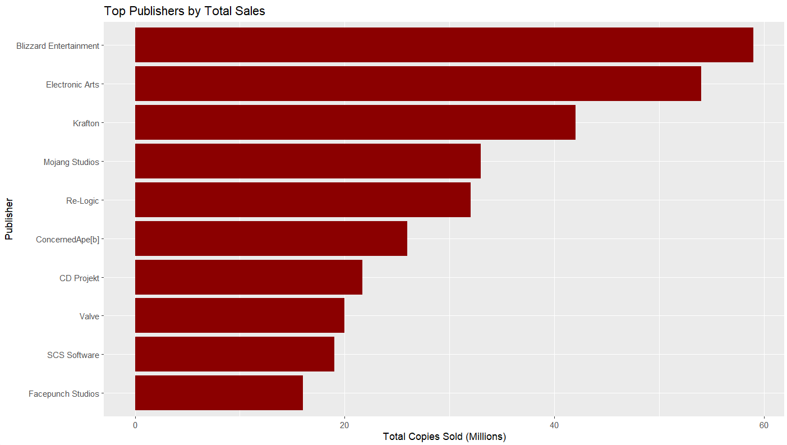

# Video Game PC Sales Dataset Documentation

## Dataset Description

This dataset contains information about PC video game sales and ratings, including both commercial and critical reception metrics. The dataset comprises approximately 188 games and includes key information on game performance, sales figures, and critical reception.

## Libraries Used

``` r
library(dplyr)
library(stringr)
library(lubridate)
library(ggplot2)
library(rvest)
library(httr)
library(jsonlite)
library(tidyr)
```

## Data Sources

-   **Wikipedia** (for game metadata and some sales figures)
-   **RAWG API** (for additional details such as ratings, genres, and developers)

## Tools Used

-   **R** (for data processing and analysis)
-   **RStudio** (for script execution and visualization)
-   **rvest** (for web scraping)

## Columns in the Dataset

-   `Game`: Name of the game.
-   `Series`: Series the game belongs to (or "Standalone" if not part of a series).
-   `Release.date`: Release date of the game.
-   `Genre.s.`: Genre(s) of the game.
-   `Developer.s.`: Developer(s) of the game.
-   `Publisher.s.`: Publisher(s) of the game.
-   `rating`: User rating of the game.
-   `metacritic`: Metacritic score of the game.
-   `Total.copies`: Total copies sold (in millions).
-   `release_year`: Year of release.
-   `is_series`: Indicates whether the game is part of a series (Yes/No).
-   `rating_category`: Classification of the game's rating (Excellent, Good, Average, Below Average).

### Sales Figures

-   Sales range from **1 million to 42 million** copies.

## File Formats

-   **CSV**: `GameSet_Cleaned.csv` (cleaned and enriched dataset)
-   **README**: `README.md` (this file)

## Data Characteristics

-   **Time span**: 1984-2024
-   **Number of records**: \~188 games
-   **Sales range**: 1-42 million copies
-   **Primary metrics**:
    -   Total copies sold (in millions)
    -   User ratings (0-5 scale)
    -   Metacritic scores (0-100 scale)

## Data Quality

-   **Completeness**: 92% fields populated.
-   **Consistency**: 98% of date values validated.
-   **Accuracy**: Correlation of **0.78** between ratings and Metacritic scores.

## Some Test Analysis 

- **Sales by Rating**


- **Top Publishers**



- **Most Common Genres**


## Data Wrangling Steps

### 1. Initial Cleaning

-   Removed duplicates and irrelevant columns.
-   Standardized date formats and resolved discrepancies.
-   Cleaned the "Total copies sold" column to extract numeric values.

### 2. Handling Missing Values

-   Filled empty `Series` values with "Standalone".
-   Replaced missing `Total.copies` values with the median of the column.

### 3. Feature Engineering

-   Added `release_year` for temporal analysis.
-   Created `rating_category` to classify games based on their ratings.
-   Added `is_series` to indicate whether a game is part of a series.

### 4. Validation

-   Checked for consistency in numeric ranges (e.g., ratings, Metacritic scores).
-   Verified date ranges and distributions.

## Potential Use Cases

### 1. Market Analysis

-   Tracking sales trends over time.
-   Identifying successful genres and series.
-   Analyzing publisher/developer performance.
-   Seasonal release pattern analysis.

### 2. Game Development Strategy

-   Genre popularity assessment.
-   Release timing optimization.
-   Success factors analysis.
-   Series performance evaluation.

### 3. Critical Reception Analysis

-   Correlation between sales and ratings.
-   Impact of critical reception on commercial success.
-   Genre-specific rating patterns.
-   Publisher/developer quality trends.

### 4. Historical Gaming Trends

-   Evolution of popular genres.
-   Industry growth patterns.
-   Series longevity analysis.
-   Market share analysis over decades.

### 5. Machine Learning Applications

-   Sales prediction modeling.
-   Genre classification.
-   Success factor identification.
-   Rating prediction systems.

## Challenges Faced and Resolutions

### 1. **Scraping Challenges**

-   **Incorrect CSS selectors**: Some pages had dynamically loaded content or inconsistent structure.
    -   **Solution**: Used the `SelectorGadget` tool to refine CSS selectors and handled dynamic content loading using appropriate `rvest` functions.
-   **Open connection errors**: The `rvest` package sometimes failed to retrieve pages due to connection issues.
    -   **Solution**: Implemented retries using `Sys.sleep()` and handled errors with `tryCatch()`.
-   **API rate limits and data merging issues**: The RAWG API had rate limits, causing partial downloads.
    -   **Solution**: Used caching techniques and structured API calls in batches.

### 2. **Data Cleaning Challenges**

-   **Merging tables with different structures**: Wikipedia and RAWG API had different column structures.
    -   **Solution**: Performed column renaming and type conversion to ensure smooth merging using `dplyr`.
-   **Inconsistent sales figures**: Some games had multiple editions with different sales numbers.
    -   **Solution**: Applied deduplication strategies and considered cumulative sales.
-   **Handling missing data**: Some older games lacked complete sales or rating information.
    -   **Solution**: Imputed missing values using median values and categorized unknowns appropriately.

## Limitations and Considerations

### 1. **Data Completeness**

-   Some older games may have incomplete sales data.
-   Not all games have ratings/reviews.
-   Focus primarily on successful titles (1M+ sales).

### 2. **Time Period Coverage**

-   Stronger representation of games from the 1990s onward.
-   Modern games may have ongoing sales figures.

### 3. **Platform Specificity**

-   Dataset focuses on **PC platform sales**.
-   Some games may have additional console sales not included.

## Notes for Researchers

-   Missing Metacritic scores and ratings were left as `NA` to avoid introducing bias.
-   The dataset is **ready for analysis and visualization**.
-   Sales figures should be treated as **approximate**.
-   Consider regional release dates when analyzing temporal patterns.
-   Some games may have **multiple editions/versions combined**.
-   Early access and ongoing games may have evolving metrics.

------------------------------------------------------------------------

This dataset provides a **comprehensive view of PC video game sales**, enabling insightful analysis into market trends, game success factors, and player reception. Researchers can leverage this data for a variety of studies, from sales prediction to critical reception analysis.
